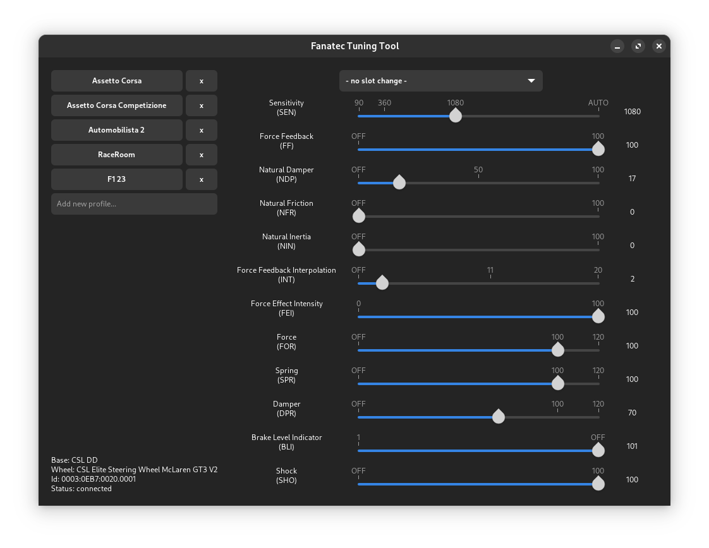

# Fanatec Tuning Tool (alpha)
Tool to configure a fanatec wheel and to switch easily from one profile to another.  

## Description

The following driver has to be installed: [gotzl/hid-fanatecff](https://github.com/gotzl/hid-fanatecff)  
It relies on `sysfs` which is provided by the driver.  
Insure you user is in group `games` and the files in `/sys/module/hid_fanatec/drivers/hid:fanatec/0003:0EB7:<product_id>.*/ftec_tuning/0003:0EB7:<product_id>.*` are writable to `games` group.  
  
For Python, these packages are needed: `pyudev`, `pygobject3`.  
  
If you are a lucky user of NixOS, you can use `nix-shell` command to setup your environment.